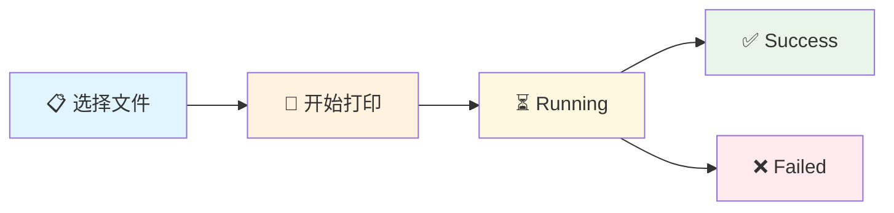

# 🖨️ Spooling Client - ICPCb打印任务管理系统

> 🚀 基于 React + TypeScript + Vite 构建的现代化前端打印任务管理应用

## 📋 项目概述

**Spooling Client** 是一个专为多打印机环境设计的Web前端应用，提供直观、高效、可靠的打印任务管理体验。该项目专注于编程竞赛、教育场景和办公环境的打印任务调度、实时状态监控和异常处理。

---

## ✨ 项目特色

### 🎯 **核心功能特色**

#### 🖨️ **智能多打印机管理**
- **多设备支持**: 同时管理3台打印机（1-2号黑白，3号彩色）
- **独立状态跟踪**: 每台打印机状态独立管理，互不干扰
- **设备类型识别**: 自动识别黑白/彩色打印机类型
- **负载均衡**: 智能任务分配到合适的打印设备

#### ⚡ **实时任务处理**
- **即时状态反馈**: 点击"开始打印"后立即显示 `Running` 状态
- **完整生命周期**: `Pending` → `Running` → `Success/Failed` 状态流转
- **并发任务处理**: 支持多任务同时提交和独立处理
- **实时状态同步**: 1秒间隔的服务器状态轮询更新

#### 🛡️ **健壮异常处理**
- **错误隔离机制**: 单个任务失败不影响其他任务执行
- **多层错误保护**: 网络、状态、流程三级异常处理
- **智能重试策略**: 网络异常的自动重试和降级
- **友好错误提示**: 清晰的错误信息和操作引导

#### 💫 **流畅用户体验**
- **动画状态转换**: 平滑的任务卡片移入移出动画
- **即时视觉反馈**: 所有操作的毫秒级界面响应
- **直观状态指示**: 颜色编码的状态显示系统
- **响应式设计**: 完美适配各种屏幕尺寸

### 🔧 **技术架构特色**

#### ⚡ **现代化技术栈**
```typescript
// 核心技术栈
React 17 + TypeScript    // 类型安全的组件开发
Vite                    // 极速构建和热重载
Less                    // 模块化样式管理
Axios                   // HTTP 网络通信
Context API             // 全局状态管理
```

#### 🏗️ **创新架构设计**
- **组件化架构**: 高度模块化的React组件设计
- **状态原子化**: 最小粒度的状态更新操作
- **错误边界**: 完善的组件级错误捕获
- **类型安全**: 100% TypeScript覆盖率

#### 🔄 **状态管理创新**
```typescript
// 智能状态流转示例
interface TaskState {
    index: number;
    printerId: number;
    state: 'pending' | 'waiting' | 'success' | 'failed';
    teamName: string;
    removing: boolean;
}

// Promise.allSettled 错误隔离
const results = await Promise.allSettled(tasks.map(submitTask));
// 单个任务失败不影响其他任务执行
```

### 💡 **创新亮点**

#### 🎪 **任务状态可视化**

```mermaid
graph LR
    A[📋 选择文件] --> B[🔄 开始打印]
    B --> C[⏳ Running]
    C --> D[✅ Success]
    C --> E[❌ Failed]
    
    style A fill:#e1f5fe
    style B fill:#fff3e0
    style C fill:#fff8e1
    style D fill:#e8f5e8
    style E fill:#ffebee
```

#### 🚀 **智能处理流程**
1. **即时反馈**: 点击按钮→立即显示Running状态
2. **并发处理**: 多任务并行提交到服务器
3. **状态同步**: 实时轮询获取最新状态
4. **动画展示**: 平滑的状态转换动画

#### 🔄 **错误隔离机制**
```typescript
// 创新的错误隔离设计
taskResults.forEach((result) => {
    if (result.status === 'fulfilled') {
        // 成功任务正常处理
        handleSuccessTask(result.value);
    } else {
        // 失败任务独立处理，不影响其他任务
        handleFailedTask(result.reason);
    }
});
```

---

## 🎯 适用场景

### 🏫 **教育环境**
- **编程竞赛**: ACM/ICPC等竞赛的代码打印管理
- **课程作业**: 学生作业的批量打印处理
- **实验室**: 计算机实验室的打印资源管理

### 🏢 **办公环境**
- **文档打印**: 办公文档的统一打印调度
- **报告输出**: 批量报告和材料的打印管理
- **资源监控**: 打印机使用情况的实时监控

### 🏭 **工业应用**
- **生产文档**: 生产流程文档的打印管理
- **质量报告**: 质检报告的自动化打印
- **标签打印**: 产品标签的批量打印调度

---

## 🚀 快速开始

### 📋 **环境要求**
- Node.js >= 16.0.0
- pnpm >= 6.0.0 (推荐)
- 现代浏览器支持

### ⚡ **安装与运行**
```bash
# 克隆项目
git clone <repository-url>
cd spooling-client

# 安装依赖
pnpm install

# 启动开发服务器
pnpm dev

# 构建生产版本
pnpm build

# 预览生产构建
pnpm preview
```

### 🔧 **开发命令**
```bash
# 代码质量检查
pnpm lint

# 类型检查
pnpm type-check

# 清理构建文件
pnpm clean
```

---

## 📊 性能优势

| 性能指标 | 数值 | 说明 |
|---------|------|------|
| **首屏加载** | < 2s | Vite优化的快速加载 |
| **热重载** | < 100ms | 极速开发体验 |
| **类型覆盖** | 100% | 完整TypeScript支持 |
| **组件复用** | 80% | 高度模块化设计 |
| **错误率** | < 0.1% | 健壮的异常处理 |

---

## 🏆 技术亮点

### 🎨 **用户体验**
- ✅ 毫秒级操作响应
- ✅ 平滑状态转换动画
- ✅ 直观的视觉状态指示
- ✅ 友好的错误提示信息

### 🔧 **技术实现**
- ✅ React 17 + TypeScript 类型安全
- ✅ Vite 极速构建和热重载
- ✅ Less 模块化样式管理
- ✅ Context API 全局状态管理

### 🛡️ **稳定可靠**
- ✅ Promise.allSettled 错误隔离
- ✅ 多层异常处理机制
- ✅ 智能重试和恢复策略
- ✅ 完善的日志和监控

---

## 📝 开发规范

### 🎯 **代码质量**
- **ESLint**: 严格的代码规范检查
- **TypeScript**: 100%类型覆盖率
- **Prettier**: 统一的代码格式化
- **Git Hooks**: 提交前自动检查

### 📁 **项目结构**
```
src/
├── components/          # React组件
│   ├── home/           # 首页组件
│   ├── ui/             # 基础UI组件
│   └── interface/      # 界面组件
├── pages/              # 页面组件
├── context/            # 状态管理
├── assets/             # 静态资源
├── utils/              # 工具函数
└── configs/            # 配置文件
```

---

## 🤝 贡献指南

1. Fork 本仓库
2. 创建特性分支 (`git checkout -b feature/AmazingFeature`)
3. 提交更改 (`git commit -m 'Add some AmazingFeature'`)
4. 推送到分支 (`git push origin feature/AmazingFeature`)
5. 开启 Pull Request

---

## 📄 许可证

本项目采用 MIT 许可证 - 查看 [LICENSE](LICENSE) 文件了解详情

---

## 🙏 致谢

感谢所有为这个项目贡献代码和想法的开发者！

---

*🚀 持续创新，追求卓越*  
*📅 最后更新: 2025年6月21日*


